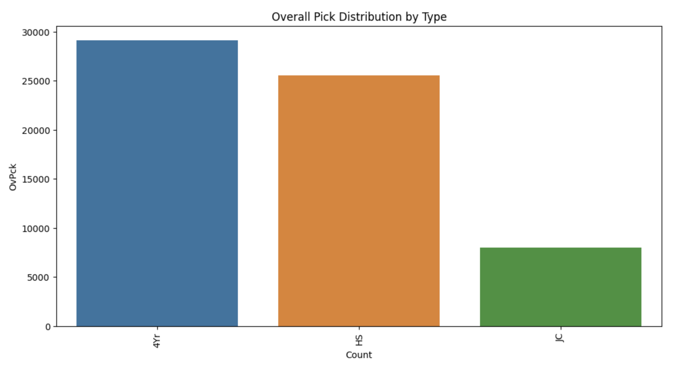
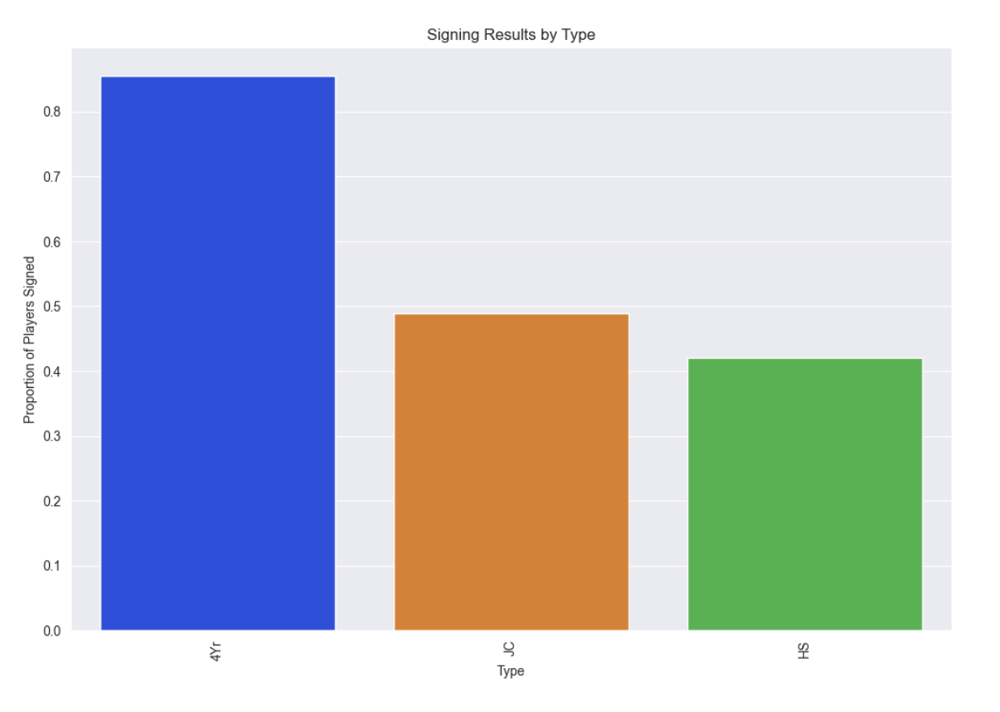

# MLB-Draft-EDA

## Methods Used
+ Data Cleaning
+ Exploratory Data Analysis
+ Data Visualization

## Technologies
+ Pandas
+ Numpy
+ Matplotlib
+ Seaborn
+ re
+ plotly express
+ plotly graph objects
+ geopandas

## Project Description
+ The dataset was found on Kaggle and was first acquired using the PyBaseball repository in Python.
+ The data was cleaned using Pandas
+ We then sought to draw insights about the trends of the MLB Draft through data manipulation and data visualization

## Project Results

Looking to get an insight into the overall trends of the MLB Draft seemed logical and a good first step into developing insights about the draft how different factors may play into whether a team drafted a player or not. Some insights can be seen from these graphs

Here we see that four year college players are the most drafted population while High School players are following close behind. Junior college players are following far behind. Taking a look at what percentage of these players signed seems like a good next step.

Four year college players are the most likely to sign followed by Junior College and High School. This can help explain why more four year college players are drafted as a team has more incentive to draft players that will sign more often. High School players have the option to decline to sign and go to college, so less of them signing makes logical senese. 

