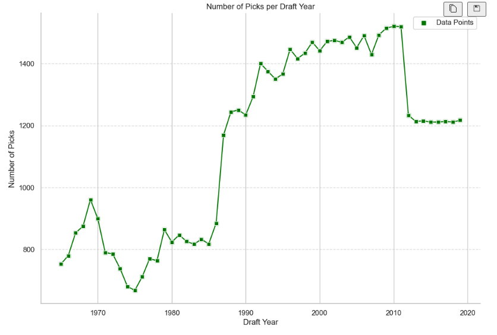

# MLB-Draft-EDA

## Table of contents
- [Motivations](#motivations)
- [Project Objective](#project-objective)
- [Methods Used](#methods-used)
- [Technologies](#technologies)
- [Project Description](#project-description)
- [Project Results](#project-results)

## Motivations
Baseball has been a passion of mine for as long as I can remember, playing throughout my childhood I had goals of playing in the MLB and was around many others who also had the same goals. Although I won't be in the MLB, I wanted to take a deeper look into the intricacies of the MLB Draft, seeing if there was more than what met the eye.

## Project Objective

The purpose of this project is to observe the overall trends in the MLB Draft during the years 1965-2019, from where were players drafted? What groups of players are more likely to sign than others? How has the money changed over time and what do players make when they are drafted? What factors play into players getting a higher signing bonus? These overarching questions led the focus of this project.

## Methods Used
+ Data Cleaning
+ Exploratory Data Analysis
+ Data Visualization

## Technologies
+ Pandas
+ Numpy
+ Matplotlib
+ Seaborn
+ re
+ Plotly express
+ Plotly graph objects
+ Geopandas

## Project Description
+ The dataset was found on Kaggle and was first acquired using the PyBaseball repository in Python.
+ The data was cleaned using Pandas
+ There was one added column that included the state/region of the player drafted
+ We then sought to draw insights about the trends of the MLB Draft through data manipulation and data visualization

## Project Results

Looking to get an insight into the overall trends of the MLB Draft seemed logical and a good first step into developing insights about the draft how different factors may play into whether a team drafted a player or not. Some insights can be seen from these graphs

Here we see that four year college players are the most drafted population while High School players are following close behind. Junior college players are following far behind. Taking a look at what percentage of these players signed seems like a good next step.

Four-year college players are the most likely to sign followed by junior college and high school players. This can help explain why more four year college players are drafted as a team has more incentive to draft players that will sign more often. High school players have the option to decline to sign and go to college, so less of them signing makes logical senese. 

However, high school players get the largest mean bonus out of all of the types of players drafted, showing the extra incentive that these players need in order to skip college and jump straight into a professional career.

Looking at the picks by state or region it shows that California, Florida and Texas have the most players drafted. However, these are also the states with the highest populations so taking a closer look at the amount of players drafted compared to the state population makes sense.

This shows states like Oklahoma and Mississippi having the highest amount of draft picks per 100,000 residents. This is most likely due to their relatively modest population size, along with their more robust presence of premier Division 1 baseball colleges.

Most players drafted chose to sign when drafted. It is interesting to see how this changed over time.

There are pretty significant spikes in signing percentage, while some of these may be due to factors not looked at in this analysis, such as popularity of the game or societal changes such as war, the number of picks in each draft, shown below seems to have a high correlation.

Monetary incentive also plays a large role in getting players to sign professional contracts. In the following plot the monetary explosion of the MLB draft can be seen. 

These spikes in bonus amount is not just due to inflation, as seen in the plot below. Therefore, there must be other influences such as the growing size of the popularity of baseball and professional sports leagues in general, that can account for all of this money that can be given to players before they have even proven themselves worthy of being in the Major Leagues.

For further insights and a look into the cleaning portion of this project, please take a look at the jupyter notebook.

